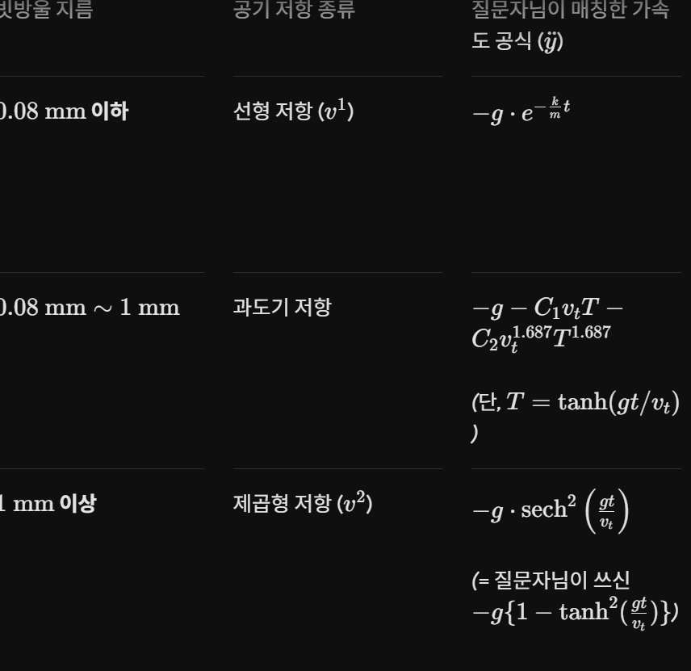

<h3>  내 아이디어 </h3>

 일단 제미나이한테 물어봤음 

몰라 이렇게 나오더라

근데 저거 적힌게 <b>가속도</b>라서

g는 중력가속도 (약 9.8), e는 그냥 e(그 뭐더라 2점 얼마),k는 저항계수(근데 저게 뭐지 나도 모르겠음),vt는 종단속도
,C1이랑 C2는 보정할라고 넣음 C1은 약 0.21 C2는 약 0.45래.

뭐 비로 안할거면 방정식이 있긴 한데......

7.03*108*질량임

그 결과가 15 미만이면 맨위에꺼(선형)

그 결과가 15이상 90000미만이면 중간에 이상한거 

결과가 90000 이상이면 끝에꺼(제곱형)

종단속도 공식도 애매한데 루트2mg/1.2*공기저항 계수*떨어지는 쪽의 단면적 인데

공기저항 계수는

예를 들어 내가 약 1500kg인 포르셰 911 카레라를 던진다 쳐.

1500*703*106=105450000000 니까

제곱형 저항이 적용됨

그러면 가속도가 

